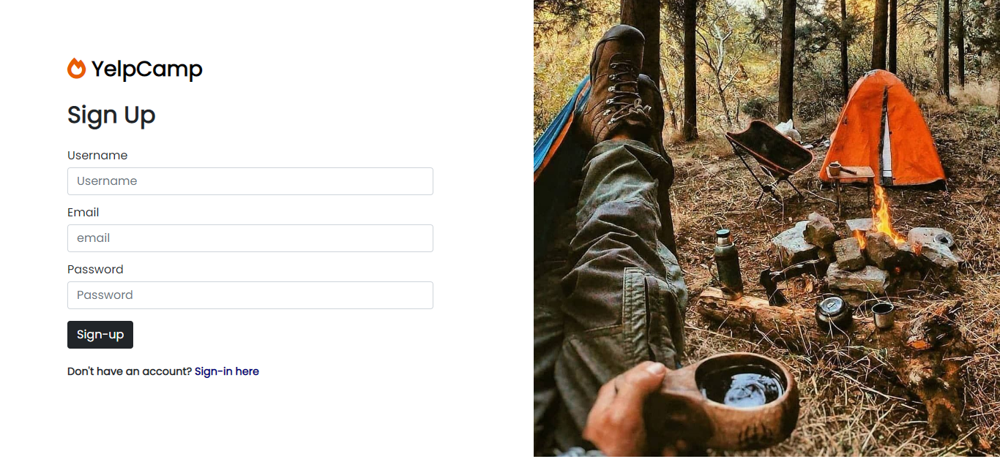

<!-- ABOUT THE PROJECT -->

## About The Project

Yelp Camp is a web application that allows you to view campgrounds with a short description. Once you login or signup you can begin to create your own campgrounds that includes a title, image, address and short description. Explore the beautiful world through our website

### Project Images

#### Sign Up


#### Sign In


<p align="right">(<a href="#top">back to top</a>)</p>

### Built With

This section should list any major frameworks/libraries used to bootstrap your project. Leave any add-ons/plugins for the acknowledgements section. Here are a few examples.

- [Express.js](https://expressjs.com/)
- [Nodejs](https://nodejs.org/en/)
- [EJS](https://ejs.co/)
- [MongoDB](https://www.mongodb.com/)
- 
<p align="right">(<a href="#top">back to top</a>)</p>

<!-- GETTING STARTED -->

## Getting Started

This is an example of how you may give instructions on setting up your project locally.
To get a local copy up and running follow these simple example steps.

### Prerequisites

This is an example of how to list things you need to use the software and how to install them.

- npm
  ```sh
  npm install npm@latest -g
  ```

### Installation

1. Clone the repo
   ```sh
   git clone https://github.com/notsoweird101/YelpCampp
   ```
2. Install NPM packages
   ```sh
   npm install
   ```
3. Check the .env.example file and make your .env file

<p align="right">(<a href="#top">back to top</a>)</p>

